# Papua New Guinea
This is my final project on Papua New Guinea

## Political subdivisions
 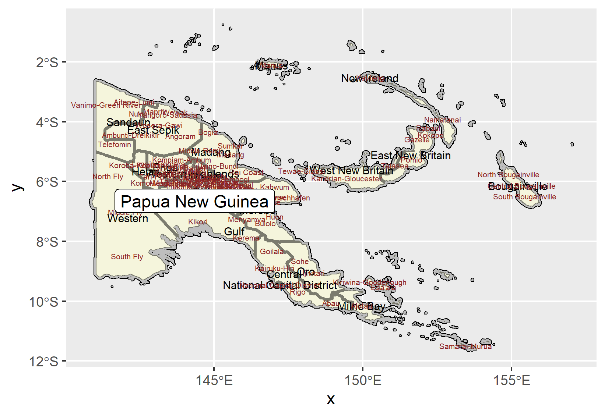

This is a map of Papua New Guinea with administrative level 1 and 2 labeled. Papua New Guinea is the Earth's second largest island.

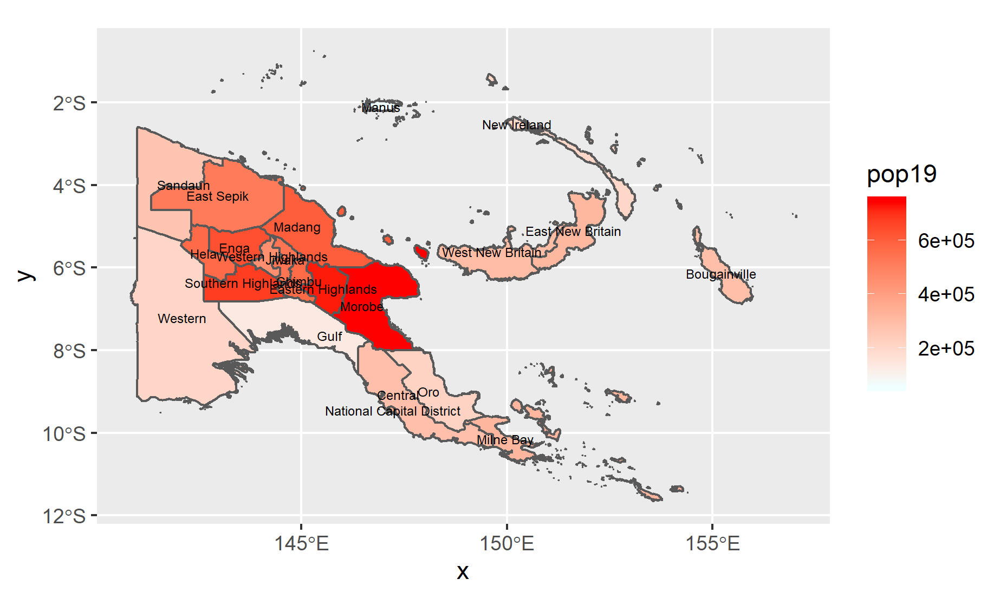

This is a map of Papua New Guidea that contains the country's population density. 

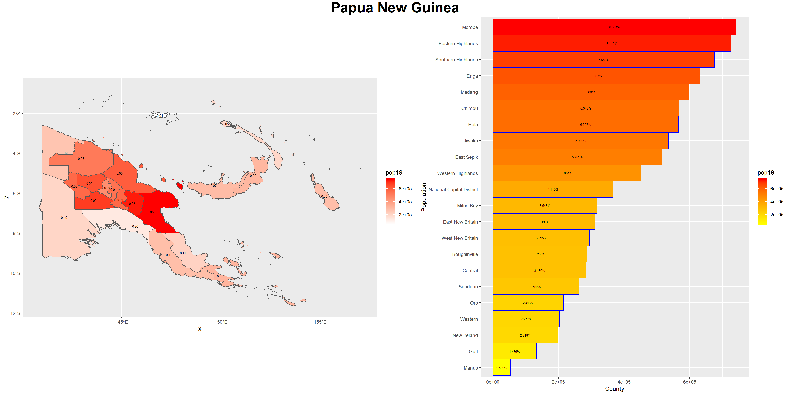

This is the project 1 individual deliverable. It is a map that illustrates of the population density of Papua New Guinea in 2019 with a bar plot of each first administrative district's population as a percent of the total population. I did not produce any of the stretch goals for Papua New Guinea because I spent the first two weeks of class trying to subset China, which later became too difficult. I did manage to create a plot of Xinjiang, China--which was part of the individual stretch goal 2 in part 1 of project 1. Following the instructions in github worked well for Papua New Guinea, so I did not have to make many changes nor did I encounter many obstacles. 

Papua New Guinea's population is concentrated in the northern part of the nation. However, the capital of Papua New Guinea, Port Moseby, is one of the less populated areas. This is because the capital was placed here to benefit white colonizers, since it was the primary port for trade. Moreover, a majority of the settlement patterns was determined by colonial planters or the availability of flat land for airstrips, which meant away from the northern mountains. Thus, the sparsely population southern portion of Papua New Guinea was created to  benefit colonizers. On the other hand, the majority of the indigenous population lives in the highlands valleys, which is the most populated areas, according to my maps. 

## Population of Papua New Guinea

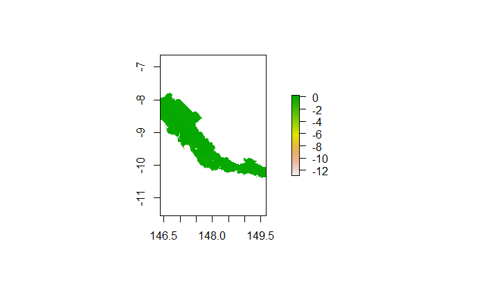

This plot above shows the difference between the population predicted by the model and the actual population in 2015 for Haiti. The population of the reddish part is underpredicted.

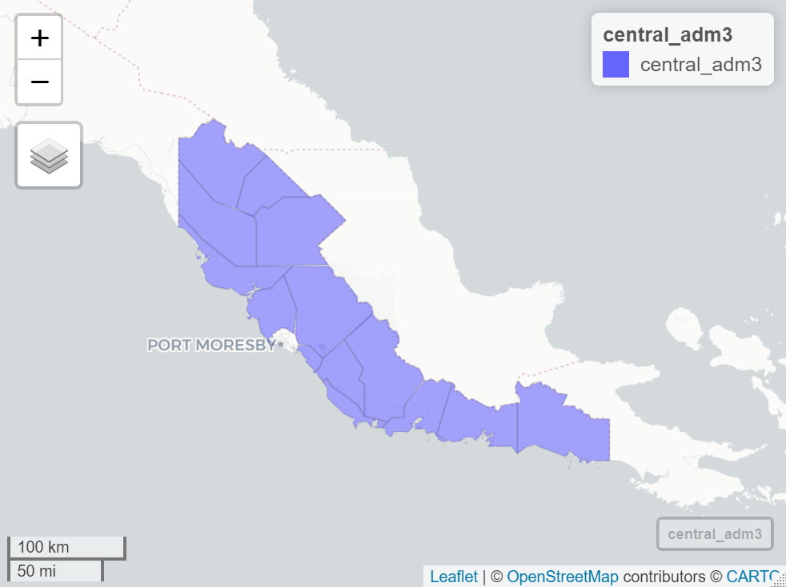
   
## Population within Rigo

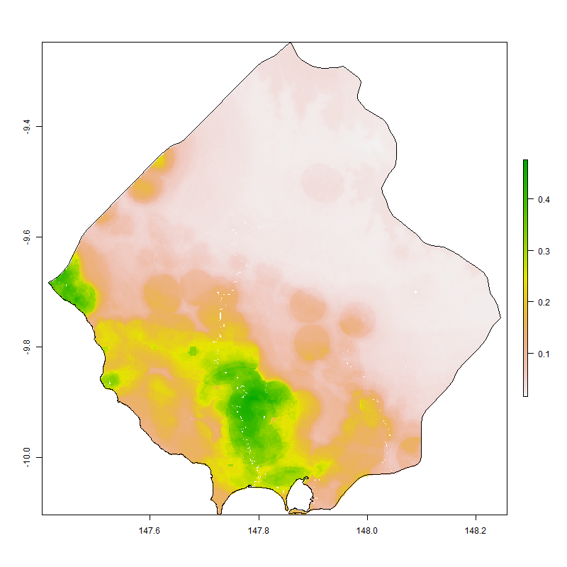

This is a plot of Rigo which is a district within the Central Provice of Papua New Guinea. With many island nations, inland areas tend to be less developed, since they are further away from shipping ports and resources obtained from the oceans. Rigo is a remote inland district, so it is sparsly populated with a population of 56,509. Additionally, Rigo is in the same province as the capital of Papua New Guinea, which is Port Moresby. And, most of Rigo's population is located towards the southern part of the district as well as the western part of the district. Both of which are cloxer in proximity to other developed areas, with the western urban area closer to Port Moresby and the souther urban area closer to Abau. 

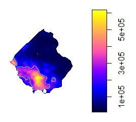

I had some issues with getting this graph because I first started with a different district in Papua New Guinea called Kairuku, which had a population of 121,586. My computer had difficulties calculating the bandwith. Because of this, I switched to a district with a smaller population. Then after switching to Rigo, I ran into a different issue with running with `countourLines()` function and had to adjust the levels to 260000 instead of 1000000.

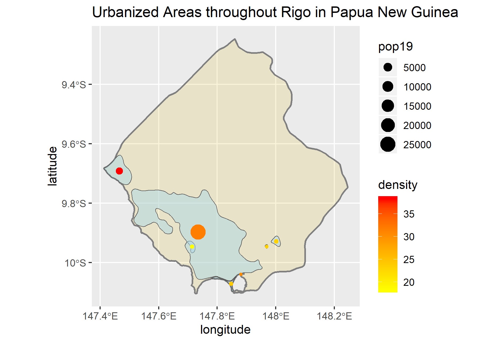

This is a plot of the urban areas with their respective population and densities in Rigo, Papua New Guinea. The highest population density is located towards the southern and western part of Rigo. This concentration of population near the western and southern ares indicate that people tend to live closer to more populated districts. To the west of Rigo lies Kairuku and the coast of Papua New Guinea, which allows people access to more resources and people. Furthermore, population clustered towards the south is closer to the the coast and the Abau District. 

## Human Settlements, Roadways, and Health Care Facilities

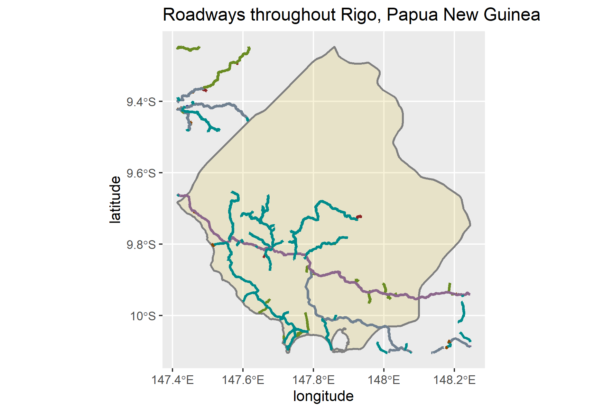

This is a plot of the roadways in Rigo, Papua New Guinea. There were seven types of identified roadways in Rigo. In my plot, I designated paths to be colored brown, residential roads to be colored red, service roads to be colored blue, tertiary roads to be colored gray, tracks to be colored olive, trunk roads to be colored plum, and unclassified roads are colored cyan. From the map, it appears that unclassified roads and trunk roads are most prevalent with some tracks coming off of the trunk roads and unclassified roads. Additionally, there are small spots with slivers of residential roads. Furthermore, there appears to be a long tertiary road that cuts through the bottom right half of Rigo. These roads connect mostly the western and southern parts of Rigo, which makes sense since the majority of the population is clustered around those areas. Furthermore, the roads through Rigo also connect Port Moresby and Abau, which are two major cities within Papua New Guinea.

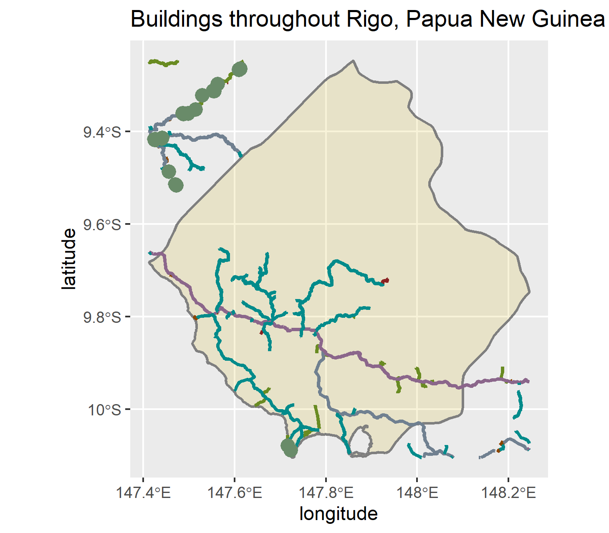

This is a plot of buildings in Rigo, Papua New Guinea. HDX defines buildings as any structure with roof. Since these buildings are not educational facilities or healthcare facilities, they are either offices or homes. All of the buildings are located near the southern and western part of Rigo, which is logical because most of the population in Rigo is concetrated in the southern and western parts of the district. 

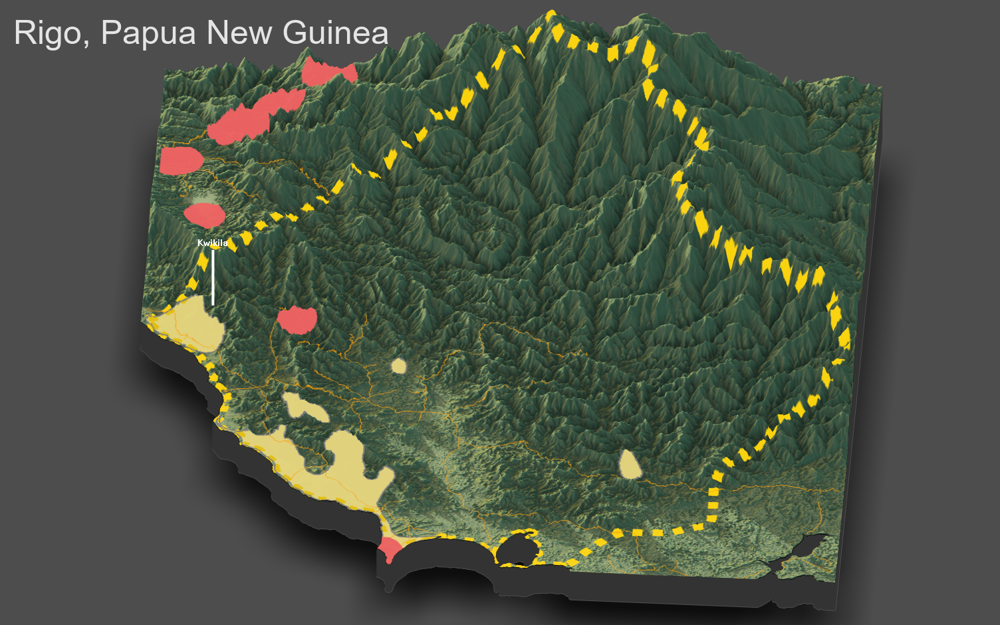

The 3D plot of Rigo, Papua New Guinea illustrates why the population is clustered near the southern and western parts of the district. This is because, as shown in the 3D plot, there are large mountains preventing development inland in the north eastern part of Rigo. The topography of Rigo impacted the development of urban areas, transportation, and health care facilities, forcing development near the southern coasts. The 3D map of Rigo helped to better understand why developement was so concentrated on the western and southern areas of Rigo. 

Moreover, it's important to understand why areas such as Rigo and Port Moresby were developed, and who benefitted from their development. Native populations in Papua New Guinea settled in the higland valleys of the northern part of Papua New Guinea. However, districts such as Rigo were only developed to benefit european colonizers as flat land was sought after for the transport of goods and airstrips. 

The state of human development in Rigo, Papua New Guinea has a room for improvement by American standards. However, the native people in Papua New Guinea are a colonized and oppressed group, since the british-ruled Australia claimed Papua New Guinea after World War 1. The people of Papua New Guinea just gained independence in 1975 and have struggled with governing their expansive territory and diverse peoples. Understanding their history with imperialism and colonialism can aid in assisting the development of Papua New Guinea to encorporate and preserve indigenous culture and language.
